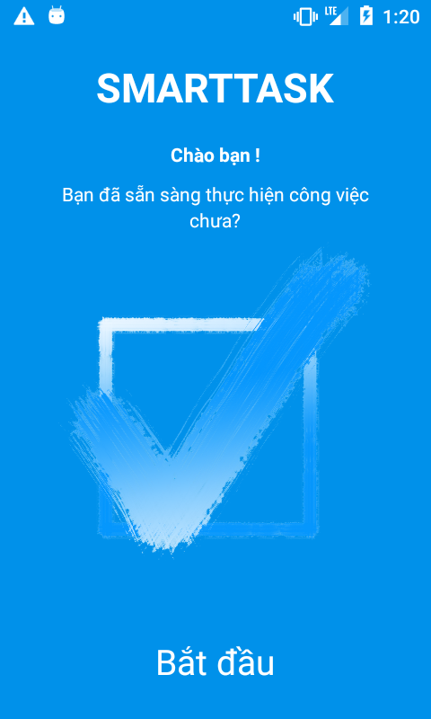
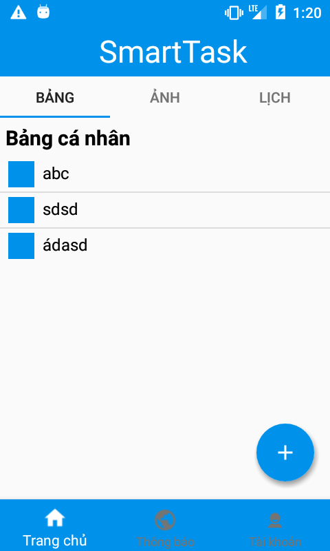
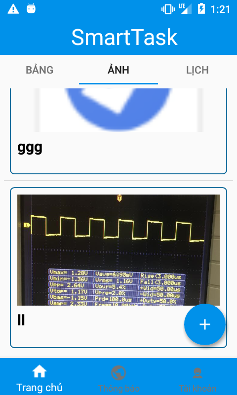
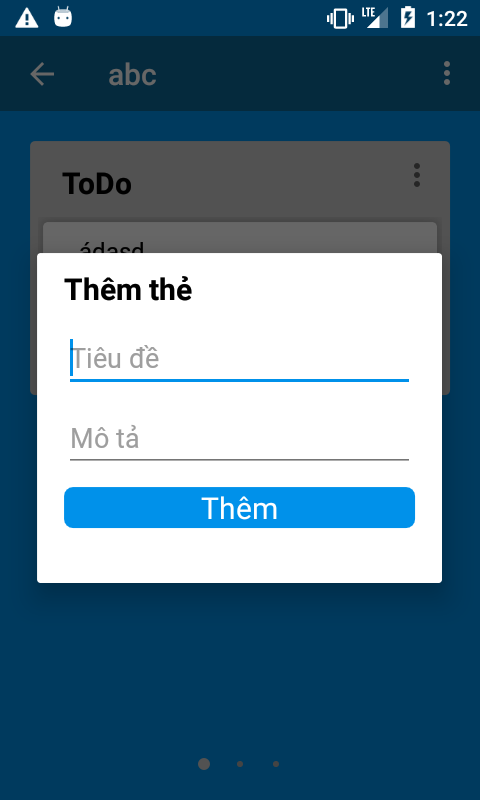

# ProjectSmartTask
Đây là một ứng dụng quản lý công việc của bạn.

## Cài đặt

File APK [download](https://actvneduvn-my.sharepoint.com/:u:/g/personal/at120826_actvn_edu_vn/EdkxYU0HiMhJtBNEclU-_RMB_ekMcJG-xGq8S2zqVCm8og?e=kjenWk).

# Một số hình ảnh ứng dụng
> Một số hình ảnh của ứng dụng khi cài đặt trên smartphone

* Màn hình giao diện 1

 
    
 
 
* Màn hình giao diện 2

 
    
     

* Màn hình giao diện 3

 
    
 
    
* Màn hình giao diện 4

 
    
    
    
* Màn hình giao diện 5

 
    
 
    
* Màn hình giao diện 6

 
    
 
    
* Màn hình giao diện 7

 
    
 
    
